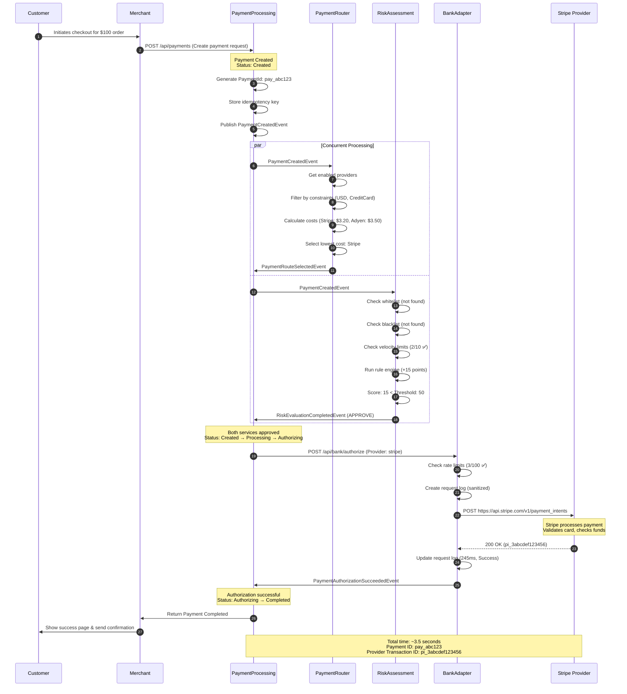
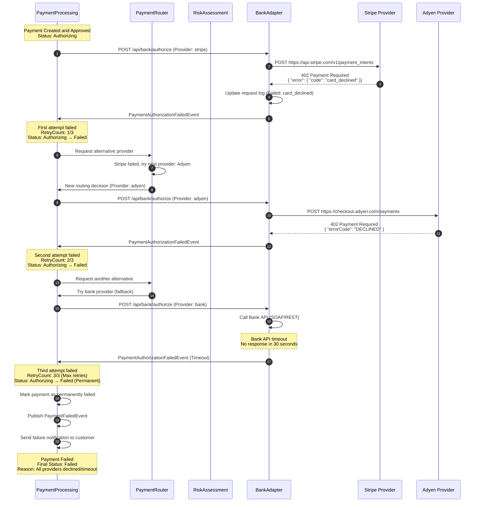
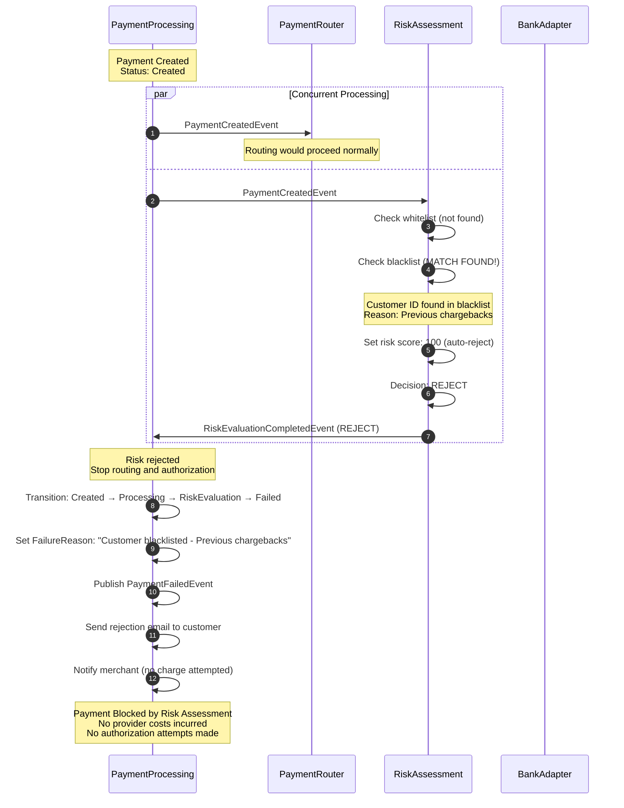
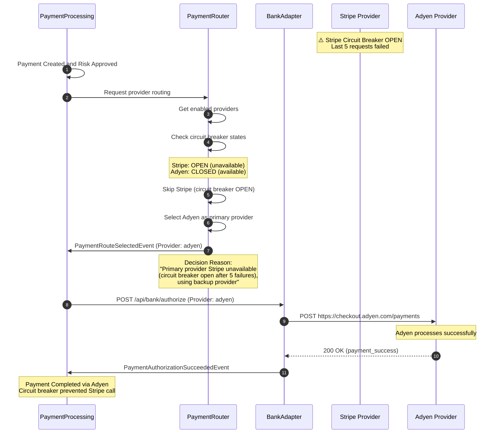
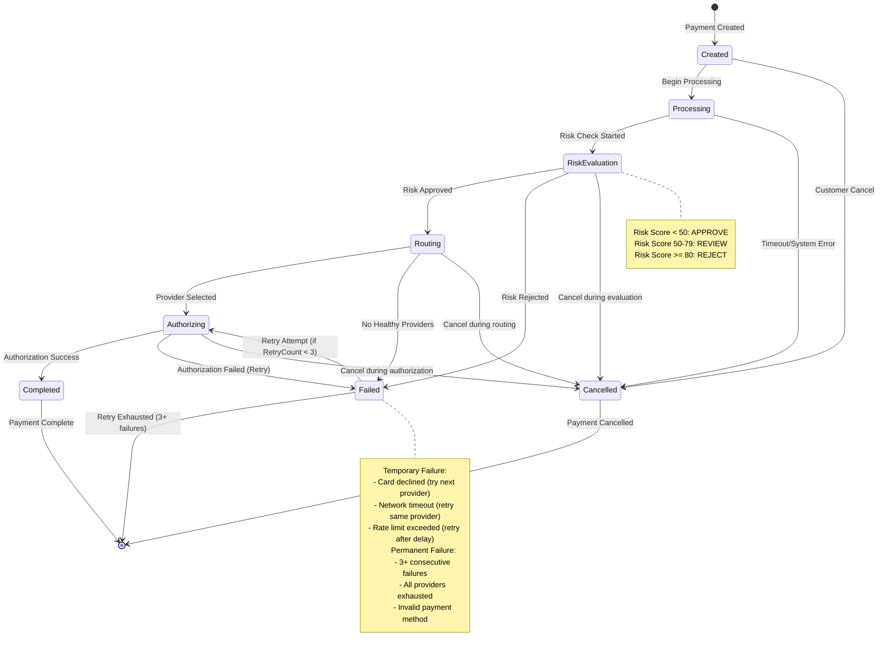
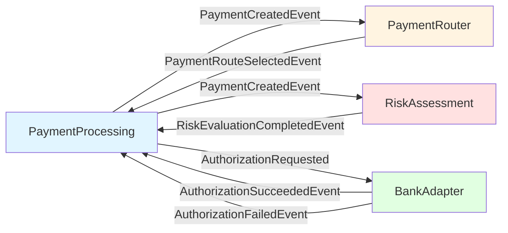
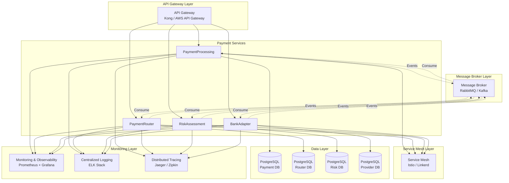
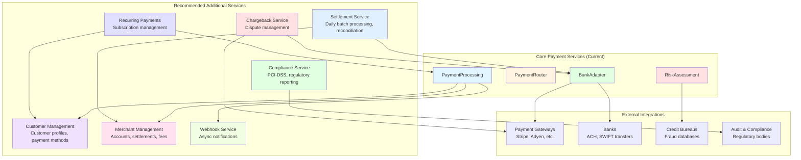
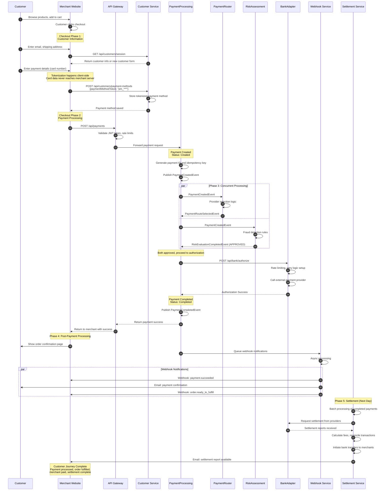

# Payment Flow Diagrams and Architecture Improvements

## Complete Payment Sequence Diagram

### **Happy Path: Successful Payment**



---

### **Alternative Flow A: Payment Declined by Provider**



---

### **Alternative Flow B: Risk Rejection**



---

### **Alternative Flow C: Provider Circuit Breaker**



---

## Payment State Machine



---

## Service Communication Patterns

### **Current Event-Driven Communication**



### **Current Limitations**

**Missing Components:**
1. **Message Broker** - Events are currently in-memory
2. **Service Mesh** - No service discovery or load balancing
3. **Distributed Tracing** - Limited cross-service observability
4. **Circuit Breaker Pattern** - Only between Router and BankAdapter
5. **Saga Pattern** - No compensating transactions for failures

---

## Recommended Architecture Improvements

### **Phase 1: Foundation Enhancements**



### **Phase 2: Additional Services**



---

## Enhanced Payment Flow (Production-Ready)

### **Complete Customer Journey**



---

## Missing Entities and Fields for Production

### **Customer Management Service**

```csharp
// Customer Entity
public class Customer
{
    public string CustomerId { get; set; }          // "cust_abc123"
    public string MerchantId { get; set; }         // Which merchant owns this customer
    public string Email { get; set; }
    public string Phone { get; set; }
    public string FirstName { get; set; }
    public string LastName { get; set; }
    public DateTime CreatedAt { get; set; }
    public DateTime? LastPurchaseAt { get; set; }
    public decimal LifetimeValue { get; set; }     // Total customer value
    public List<PaymentMethod> PaymentMethods { get; set; }
    public Address DefaultAddress { get; set; }
}

// Payment Method Entity
public class PaymentMethod
{
    public string PaymentMethodId { get; set; }     // "pm_visa_4242"
    public string CustomerId { get; set; }
    public PaymentMethodType Type { get; set; }    // CreditCard, DebitCard, BankAccount
    public string Token { get; set; }              // "tok_***" (never store raw card numbers)
    public string Last4 { get; set; }              // "4242" (for display only)
    public string ExpiryMonth { get; set; }        // "12"
    public string ExpiryYear { get; set; }         // "2025"
    public string CardBrand { get; set; }          // "Visa", "MasterCard", "Amex"
    public bool IsDefault { get; set; }
    public bool IsVerified { get; set; }           // 3D Secure verified
    public DateTime CreatedAt { get; set; }
    public DateTime? LastUsedAt { get; set; }
}
```

### **Merchant Management Service**

```csharp
// Merchant Entity
public class Merchant
{
    public string MerchantId { get; set; }         // "merchant_001"
    public string BusinessName { get; set; }
    public string LegalName { get; set; }
    public string TaxId { get; set; }
    public BusinessType BusinessType { get; set; } // Retail, E-commerce, SaaS, etc.
    public string Website { get; set; }
    public Address BusinessAddress { get; set; }
    public MerchantStatus Status { get; set; }     // Active, Suspended, UnderReview
    public DateTime OnboardedAt { get; set; }
    public List<MerchantAccount> Accounts { get; set; }
}

// Merchant Account Entity
public class MerchantAccount
{
    public string AccountId { get; set; }          // "acct_001"
    public string MerchantId { get; set; }
    public string ProviderId { get; set; }         // Which provider handles this
    public string ProviderAccountId { get; set; }  // Provider's account ID
    public Currency Currency { get; set; }
    public FeeStructure FeeStructure { get; set; }
    public SettlementSchedule SettlementSchedule { get; set; }
    public string BankAccountNumber { get; set; }  // For settlement deposits
    public string RoutingNumber { get; set; }
    public bool IsActive { get; set; }
}

// Fee Structure Entity
public class FeeStructure
{
    public decimal PercentageRate { get; set; }    // 2.9% = 0.029
    public decimal FixedFee { get; set; }         // $0.30 per transaction
    public decimal InternationalRate { get; set; } // 3.9% for international cards
    public decimal AmexRate { get; set; }          // 3.5% for American Express
    public decimal RefundFee { get; set; }          // $0.25 for refunds
    public decimal ChargebackFee { get; set; }      // $15.00 per chargeback
    public decimal MonthlyFee { get; set; }         // $10.00 monthly statement fee
    public decimal ReservePercentage { get; set; }  // 10% reserve for rolling reserve
    public int ReserveDurationDays { get; set; }    // 180 days
}
```

### **Enhanced Payment Transaction**

```csharp
// Enhanced Payment Transaction
public class PaymentTransaction
{
    public string TransactionId { get; set; }      // "txn_abc123"
    public string PaymentId { get; set; }          // "pay_xyz789"
    public string MerchantId { get; set; }
    public string CustomerId { get; set; }
    public string PaymentMethodId { get; set; }
    public string ProviderId { get; set; }
    public string ProviderTransactionId { get; set; }
    
    // Transaction Details
    public TransactionType Type { get; set; }      // Sale, PreAuth, Capture, Refund
    public decimal Amount { get; set; }
    public string Currency { get; set; }
    public decimal FeeAmount { get; set; }         // Calculated fee
    public decimal NetAmount { get; set; }         // Amount - fee
    
    // Authorization Details
    public string? AuthorizationCode { get; set; }
    public string? AvsResult { get; set; }         // Address Verification
    public string? CvvResult { get; set; }          // CVV check
    public string? ThreeDSecureVerificationId { get; set; }
    
    // Status and Timing
    public TransactionStatus Status { get; set; }
    public DateTime CreatedAt { get; set; }
    public DateTime? AuthorizedAt { get; set; }
    public DateTime? CapturedAt { get; set; }
    public DateTime? SettledAt { get; set; }
    public DateTime? RefundedAt { get; set; }
    
    // Order Context
    public string? OrderId { get; set; }
    public string? InvoiceId { get; set; }
    public string? Description { get; set; }
    public Dictionary<string, string> Metadata { get; set; }
    
    // Relationships
    public string? OriginalTransactionId { get; set; } // For refunds
    public List<TransactionAdjustment> Adjustments { get; set; }
}
```

---

## Implementation Priority Roadmap

### **Phase 1: Foundation (Current System - Educational) ✅**
- ✅ Core payment processing logic
- ✅ Service communication patterns  
- ✅ Basic fraud detection
- ✅ Provider abstraction
- ✅ State management

### **Phase 2: Production Readiness (Next 3-6 months)**
1. **Message Broker Integration** (2 weeks)
   - Replace in-memory events with RabbitMQ/Kafka
   - Implement message persistence and deduplication
   - Add dead letter queues for error handling

2. **Enhanced Monitoring** (2 weeks)
   - Distributed tracing with Jaeger
   - Centralized logging with ELK stack
   - Metrics dashboards with Grafana

3. **Customer Management** (4 weeks)
   - Customer profiles and payment methods
   - PCI-DSS compliant tokenization
   - 3D Secure authentication

4. **Merchant Management** (4 weeks)
   - Merchant onboarding and underwriting
   - Fee structure configuration
   - Account management

### **Phase 3: Advanced Features (6-12 months)**
1. **Settlement Service** (6 weeks)
   - Daily batch processing
   - Bank reconciliation
   - Fee calculation and reporting

2. **Enhanced Fraud Detection** (8 weeks)
   - Machine learning models
   - Behavioral analysis
   - Device fingerprinting

3. **Compliance Framework** (8 weeks)
   - PCI-DSS Level 1 preparation
   - Regulatory reporting automation
   - Audit trail enhancement

### **Phase 4: Enterprise Features (12+ months)**
1. **Global Expansion**
   - Multi-currency support
   - Cross-border payments
   - Alternative payment methods

2. **Advanced Products**
   - Recurring payments/subscriptions
   - Installment plans
   - Buy now, pay later (BNPL)

---

## Educational vs Production Comparison

| Aspect | Educational System (Current) | Production System |
|--------|----------------------------|------------------|
| **Communication** | In-memory events | Message broker (RabbitMQ/Kafka) |
| **Data Persistence** | Basic PostgreSQL | Distributed database with clustering |
| **Monitoring** | Basic logging | Full observability stack |
| **Security** | Basic auth | OAuth2, mTLS, vault integration |
| **Compliance** | PCI-DSS placeholders | Full PCI-DSS Level 1 certification |
| **Fraud Detection** | Rule-based | ML models + behavioral analysis |
| **Customer Data** | Not implemented | Full customer lifecycle |
| **Merchant Features** | Not implemented | Complete merchant platform |
| **Settlement** | Not implemented | Daily settlement + reconciliation |
| **Geographic** | Single region | Multi-region, global compliance |
| **Scalability** | Single instances | Auto-scaling, load balancing |
| **Disaster Recovery** | Not implemented | Multi-region failover |

---

## Conclusion

This comprehensive payment ecosystem provides an excellent foundation for understanding fintech and payment processing. The current system demonstrates core concepts like:

- **Service-oriented architecture** with clear separation of concerns
- **Event-driven communication** for loose coupling
- **State machine patterns** for payment lifecycle management
- **Retry logic and circuit breakers** for resilience
- **Risk assessment** for fraud prevention
- **Provider abstraction** for multi-provider support

**For Production Use:** Significant enhancements would be needed in customer management, merchant operations, settlement processing, compliance, and observability.

**For Learning:** This system perfectly demonstrates payment processing concepts without overwhelming complexity, making it ideal for understanding the fintech domain.

The recommended improvements maintain educational clarity while showing how real-world payment systems scale and handle production requirements.